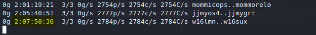
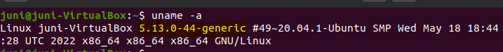
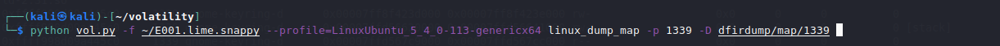
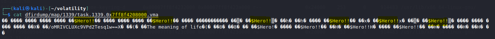

# UNODC AfricaCTF 2022 Juni19 Writeup

Challenge: You shall pass!

Given the compressed memory dump the first step was obviously to
uncompress it:

`sudo ./avml-convert /mnt/vm-shared/14257525-E001-MEM/E001.lime.snappy
E001.lime.snappy`

Moving forward the uncompressed version will be used.

Next step: find out the volatility profile that suits it. Big failure:
volatility2 doesn't find any matching profile and volatility3 says no
matching symbol table is found. Few greps in the memory reveal there
were some sudo commands ran inside and possibly a password prompt was
satisfied by the user but no further info about the password. Another
grep with the appropriate regex revealed the hashed password
(/etc/shadow content) of the user bighero:

![A picture containing graphical user interface Description
automatically
generated]

Great!! We can now try crack it?

Yes, you read right: 2 days, 7 hours, 50 mins and 36 secs later still
not cracked... Wrong approach.

Why not go back to volatility and make it work? Profile building from
scratch can be helpful but how to know the suitable OS and kernel? Since
we have the disk image, we can browse through the files with AccessData
FTK Imager and print the `/etc/issue file`

I went ahead and spawned a Linux Mint 20.3 VM, built a profile, added it to volatility

Still not accepting this profile

I came across a post that suggested to use 'banners' plugin in
volatility3 to have an accurate idea of the OS version and Kernel in
use. I then did so:

I considered the first two results and started to look for the ISO of
ubuntu 20.04

I went for a `20.04.4` image I found on the internet but quickly figured
out I was very wrong since the banner precisely stated `20.04.1`. I
quickly went back to get the right image at [this
URL](http://old-releases.ubuntu.com/releases/20.04.1/ubuntu-20.04.1-desktop-amd64.iso)

I then installed it in my VirtualBox to proceed Only to figure out it's
kernel still doesn't match the one in the banner.

I need a 5.4.0-113-generic !!

I decided to manually add a second kernel.

Now rebooting I go to "Advanced options" in the GRUB and find my second
brand new (and suitable) kernel

I can go ahead and build the volatility3 symbol table and also
volatility2 profile (you never know haha)

The symbol table generation required the kernel's debug symbols (not the
compressed vmlinuz available in /boot/) so I had to install those (6GB)

Now I can find the needed vmlinux file at
/usr/lib/debug/boot/vmlinux-5-4-0-113-generic

I then build the symbol table with `./dwarf2json --elf
/usr/lib/debug/boot/vmlinux-5-4-0-113-generic --system-map
/boot/System.map-5.4.0-113-generic | xz -c
Ubuntu20.04x64-5.4.0-113-generic.json.xz`

(This crashed several times and after a lot of googling I read that the
process was actually killed by the OS because of insufficient memory and
that it was recommended to set RAM to 8GB when generating a symbol table
which made me increase my VM ram to 8GB and retry)

Then I put the file created to volatility3/volatility3/symbols/linux/ so
that it can now handle my memory image. I also built a profile for
volatility2 with dwarf as shown
[here](https://www.youtube.com/watch?v=6Frec5cGzOg) and added it to
volatility/ volatility/plugins/overlays/linux/.

Time to play around with volatility (2 and 3). First thing was to use
volatility2's plugins linux_check_creds and linux_truecrypt_passphrase
to see if some password comes out but none of them gave results. Then I
looked closely at running processes with linux_psaux.

In the first place I thought of inspecting sudo but few
[research](https://bugzilla.gnome.org/show_bug.cgi?id=764014) brought
to my attention that gnome keyring daemon stores cleartext passwords in
memory and fortunately it was running in our memory image.

First I went back to the disk image to collect its
/home/bighero/.local/share/keyrings/login.keyring and (shamelessly)
replace my identical clone VM's login.keyring with it: expecting its
gnome seahorse to display the content but as you can imagine it wasn't
that simple.

So, I went back to my memory image and looked closely to the keyring daemon:

Pid: 1339

I decide to list its memory maps using linux_proc_maps

152 memory maps in total for that process (good luck in digging into all
of them looking for the password)

I then decided to dump my clone vm's memory same way the challenge dump
was realized (using avml) and analyze it to find out where exactly lies
the password in the process memory.

After the dump realized I used linux_dump_map to dump all memory maps of
the process gnome-keyring-daemon

Then I grep in all the generated process map files to find out which one
contained my password on that clone VM. (My password was 'zere-iz')

From the .vma file name I could look in the process maps and find out
which one of those maps' file it is.

It turned out to be the 142nd mem map out of the 152 mem maps of the
gnome-keyring-d process.

Now I go back to the challenge VM and after dumping all its
gnome-keyring-d's 152 memmaps to a directory, I cat the 142nd in the
list.

(The 142nd  highlighted)

Now I cat the corresponding file using the start offset value

I can see the password printed in clear text all over the place!!!

Flag: \$Hero!!

-Juni19-
